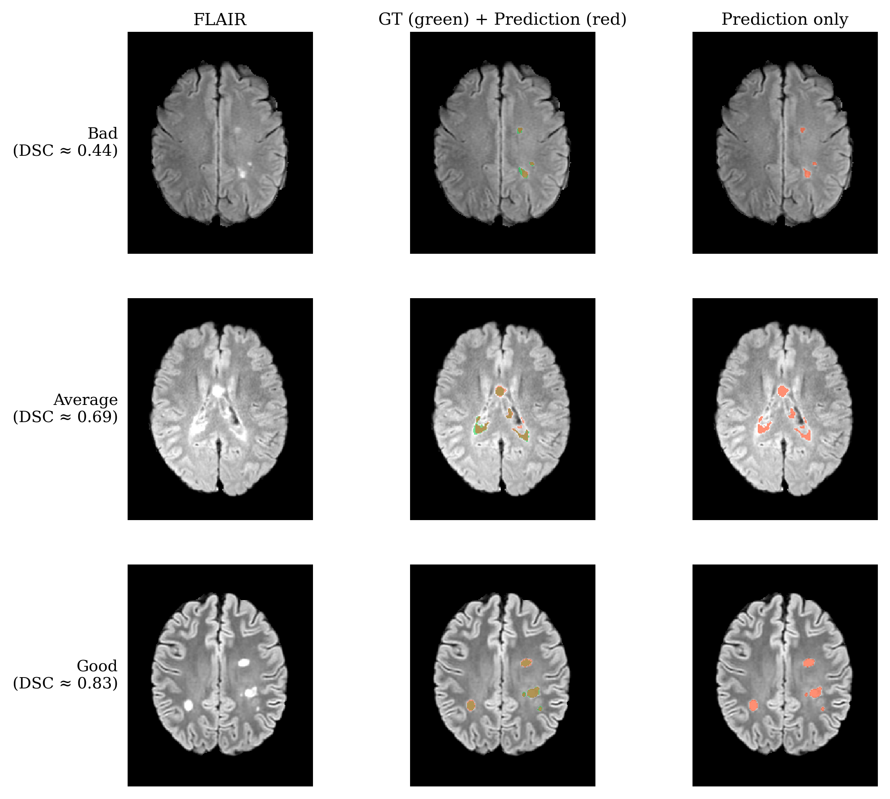
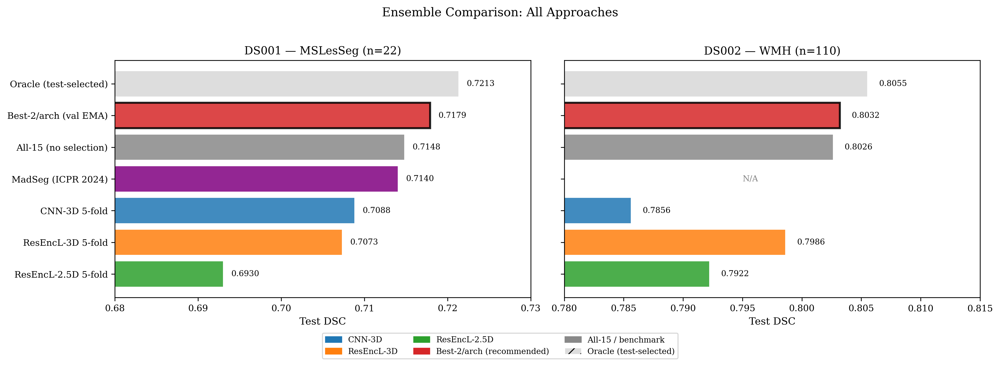

<div align="center">

# MSLesionTool

**Automated multiple-sclerosis lesion segmentation from brain MRI, powered by a multi-architecture nnU-Net ensemble.**


[](https://huggingface.co/Broozey/MSLesionTool)




</div>

## Why this tool

- **State-of-the-art accuracy** — 0.7179 Dice on MSLesSeg-2024, exceeding the ICPR 2024 MadSeg challenge winner (0.714).
- **A full desktop application *and* a headless pipeline** — interactive PyQt6 GUI for clinicians/researchers, plus a CLI and Docker image for batch/HPC workflows.
- **GPU-accelerated inference** — optional ONNX Runtime backend (TensorRT/CUDA) for fast prediction; CPU fallback included.
- **Built-in manual refinement** — brush/eraser tools, probability-based lesion growth, and lesion classification on top of the automated result.

## Results

A three-architecture ensemble (CNN 3D + ResEncL 3D + 2.5D) selected on validation EMA `fg_dice` — **no test-set leakage**.

| Dataset | Dice |
|---------|------|
| MSLesSeg-2024 (DS001) | **0.718** |
| WMH-2017 (DS002) | **0.803** |

<div align="center">

</div>

## Features

- **3-architecture ensemble** — CNN 3D + ResEncL 3D + 2.5D (K=7) for robust segmentation.
- **Multi-planar viewer** — axial, sagittal, coronal views with aspect-ratio-correct display.
- **3D rendering** — real-time lesion mesh with classification colouring.
- **Manual editing** — brush/eraser tools, probability-based lesion growth, lesion classification.
- **ONNX Runtime support** — optional GPU-accelerated inference via TensorRT/CUDA.
- **CLI + Docker** — headless batch processing for cloud/HPC environments.
- **Self-provisioning weights** — missing model weights download automatically from HuggingFace on first launch.

## Quick Start

### Installation

```bash
# 1. Create and activate a virtual environment (Python 3.9–3.12)
python -m venv .venv
# Windows:
.venv\Scripts\activate
# Linux/macOS:
source .venv/bin/activate

# 2. Run the installer (auto-detects your GPU and CUDA version)
python install.py

# 3. Download model weights (or let the GUI fetch them on first launch)
python download_models.py
```

The installer detects your NVIDIA GPU and installs PyTorch with the correct CUDA support, installs all dependencies, and sets up the custom nnU-Net trainers needed for inference.

**Install options**
```bash
python install.py --cpu          # Force CPU-only (no GPU)
python install.py --cuda 12.8    # Override CUDA version detection
python install.py --cli-only     # Minimal CLI deps (no GUI)
python install.py --verify-only  # Check an existing installation
```

**Download options**
```bash
python download_models.py              # Default: PyTorch checkpoints (folds 1, 3)
python download_models.py --onnx       # Also download ONNX models
python download_models.py --onnx-only  # Only ONNX (smaller, ~1.2 GB)
python download_models.py --all-folds  # All 5 folds per architecture
```

**Manual install** (if you already have PyTorch set up):
```bash
pip install -r requirements.txt
```

## Usage

### GUI

```bash
python msseg_app.py
```

1. Click **Open Patient** to select FLAIR and T1 NIfTI files.
2. Click **Run Segmentation** to run the ensemble.
3. Review results in the multi-planar viewer.
4. Optionally refine with the manual tools, then **Save Results**.

### Command line

```bash
# Single patient
python -m msseg.cli --flair patient_flair.nii.gz --t1 patient_t1.nii.gz -o seg.nii.gz

# Batch processing
python -m msseg.cli --batch /data/subjects/ --output-dir /data/results/

# ONNX backend (faster, requires exported models)
python -m msseg.cli --flair f.nii.gz --t1 t.nii.gz -o seg.nii.gz --backend onnx
```

### Docker

```bash
docker build -t msseg .
docker run --gpus all \
  -v /path/to/data:/data \
  -v /path/to/models:/app/msseg \
  msseg --flair /data/flair.nii.gz --t1 /data/t1.nii.gz -o /data/seg.nii.gz
```

### ONNX export

```bash
python scripts/export_onnx.py                          # Default Best-2/arch (6 models)
python scripts/export_onnx.py --all                    # All 15 models
python scripts/export_onnx.py --arch cnn3d --folds 1 3 # Specific arch + folds
```

## Architecture

| Model | Type | Patch size | Input | Checkpoint |
|-------|------|-----------|-------|-----------|
| CNN 3D | PlainConvUNet 3D | 128×128×128 | 2ch (FLAIR+T1) | ~239 MB/fold |
| ResEncL 3D | ResidualEncoderUNet 3D | 160×192×160 | 2ch (FLAIR+T1) | ~782 MB/fold |
| 2.5D (K=7) | PlainConvUNet 2D | 192×160 | 14ch (7 slices × 2ch) | ~158 MB/fold |

Default ensemble: folds {1, 3} for all three architectures = **6 models**. Selection is based on validation EMA `fg_dice` (no test-set leakage).

**Ensemble modes**
- **Best-2/arch (recommended)** — 6 models, the top 2 folds per architecture.
- **All 15 folds** — full 5-fold ensemble for all three architectures.
- **Custom** — select individual architectures and folds in the GUI.

See [docs/architecture.md](docs/architecture.md) for the full design.

## Input requirements

- **FLAIR** and **T1** volumes in NIfTI format (`.nii` or `.nii.gz`).
- Volumes must be co-registered (same space/resolution).
- nnU-Net handles resampling to 1 mm isotropic and z-score normalisation internally.
- T2 is optional (display only, not used for segmentation).

## Model weights

Model weights are hosted on [HuggingFace](https://huggingface.co/Broozey/MSLesionTool). They download automatically on first launch, or run `python download_models.py` to fetch them ahead of time.

- ~2.4 GB for Best-2 PyTorch checkpoints, ~1.2 GB for ONNX models.
- An NVIDIA GPU with CUDA is recommended for fast inference; a CPU fallback is available.

## Project structure

```
MSLesionTool/
├── msseg_app.py            # GUI application
├── install.py              # Cross-platform installer
├── download_models.py      # Download weights from HuggingFace
├── build_msseg_exe.py      # PyInstaller build (standalone .exe)
├── Dockerfile              # GPU inference container
├── pyproject.toml          # Packaging metadata
├── msseg/                  # Core package
│   ├── cli.py              # CLI entry point
│   ├── constants.py        # Architecture registry, model resolution
│   ├── io.py               # NIfTI loading/saving
│   ├── inference.py        # PyTorch inference backend
│   ├── inference_ort.py    # ONNX Runtime backend
│   ├── viewer.py / mesh.py / splash3d.py / theme.qss
│   └── cnn3d/ resencl3d/ conv25d/   # Per-architecture config (weights via HuggingFace)
├── trainers/               # Custom nnU-Net trainers (used by the installer)
├── scripts/                # ONNX export, mesh extraction, environment setup
└── docs/                   # Architecture, CLI, Docker, and research notes
```

## Contributing & support

Issues, pull requests, and platform-testing feedback are welcome — see [CONTRIBUTING.md](CONTRIBUTING.md). If you hit a problem on your platform, please open a [GitHub issue](https://github.com/Brozey/MSLesionTool/issues) with your OS, Python version, and GPU/CUDA details.

## Citation

<details>
<summary>Cite this tool</summary>

```bibtex
@software{broz2025mslesiontool,
  title   = {MSLesionTool: Multi-Architecture nnU-Net Ensemble for Automated MS Lesion Segmentation},
  author  = {Bro{\v z}, Jind{\v r}ich},
  year    = {2025},
  url     = {https://github.com/Brozey/MSLesionTool},
  license = {Apache-2.0}
}
```
</details>

<details>
<summary>References (frameworks &amp; datasets)</summary>

```bibtex
@article{isensee2021,
  title={nnU-Net: a self-configuring method for deep learning-based biomedical image segmentation},
  author={Isensee, Fabian and Jaeger, Paul F and Kohl, Simon AA and Petersen, Jens and Maier-Hein, Klaus H},
  journal={Nature Methods}, volume={18}, number={2}, pages={203--211}, year={2021},
  publisher={Nature Publishing Group}
}

@article{guarnera2025,
  title={A multi-center MRI dataset of multiple sclerosis with cross-sectional and longitudinal data},
  author={Guarnera, Francesco and Rondinella, Alessia and Mammone, Nadia and others},
  journal={Scientific Data}, volume={12}, year={2025}, publisher={Nature Publishing Group}
}

@article{kuijf2019,
  title={Standardized assessment of automatic segmentation of white matter hyperintensities and results of the WMH segmentation challenge},
  author={Kuijf, Hugo J and Biesbroek, J Matthijs and De Bresser, Jeroen and others},
  journal={IEEE Transactions on Medical Imaging}, volume={38}, number={11}, pages={2556--2568}, year={2019},
  publisher={IEEE}
}

@inproceedings{ronneberger2015,
  title={U-Net: Convolutional Networks for Biomedical Image Segmentation},
  author={Ronneberger, Olaf and Fischer, Philipp and Brox, Thomas},
  booktitle={MICCAI}, pages={234--241}, year={2015}, publisher={Springer}
}

@inproceedings{he2016,
  title={Deep Residual Learning for Image Recognition},
  author={He, Kaiming and Zhang, Xiangyu and Ren, Shaoqing and Sun, Jian},
  booktitle={CVPR}, pages={770--778}, year={2016}
}
```
</details>

## License

Apache License 2.0. See [LICENSE](LICENSE).

## Acknowledgements

Built on [nnU-Net](https://github.com/MIC-DKFZ/nnUNet). Trained and evaluated on the MSLesSeg-2024 (ICPR 2024) and WMH-2017 (MICCAI 2017) datasets.
